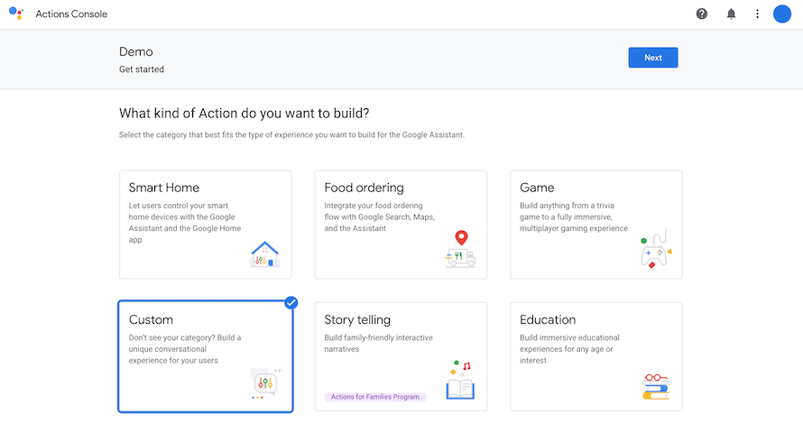
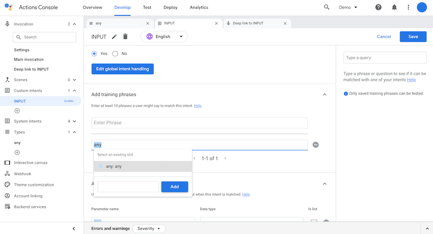
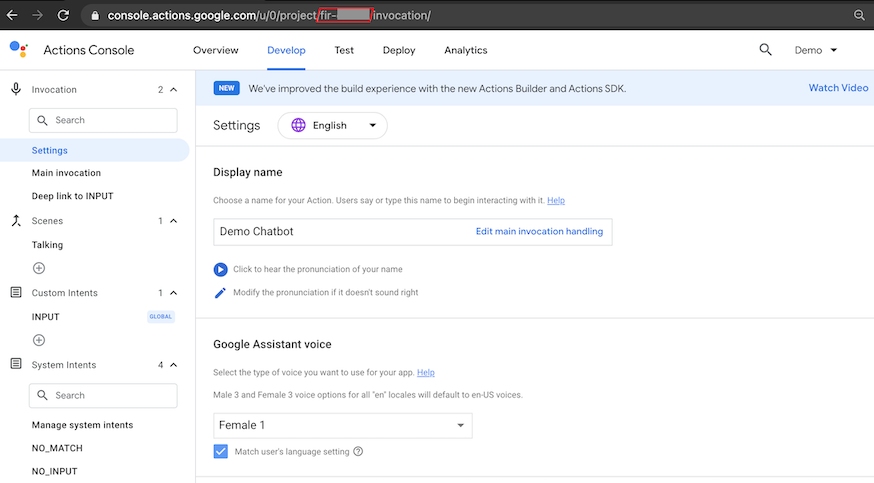

# GOOGLE ACTIONS CHATBOT INTEGRATION

### TABLE OF CONTENTS
* [Introduction](#introduction)
* [Features](#features)
* [Building the Google Connector](#building-the-google-connector)
    * [Required Configuration](#required-configuration)
    * [Optional Configuration](#optional-configuration)
	* [ESCALATION (chat.php)](#escalation-chatphp)
	* [CONVERSATION (conversation.php)](#conversation-conversationphp)
	* [ENVIRONMENTS (environments.php)](#environments-environmentsphp)
	* [Deployment](#deployment)
* [Google Configuration](#google-actions-configuration)
    * [Account](#account)
    * [Action ID](#action-id)
* [Google Requests](#google-requests)
* [Prepare your Inbenta instances](#prepare-your-inbenta-instances)
    * [Text Content](#text-content)
    * [Built-in Intent response](#builtin-intent-response)


## **Introduction**
You can extend Inbenta’s chatbot capabilities to voice with this connector to integrate with the Google Assistant.

## **Features**
The following features of Inbenta’s chatbot are supported in the Google integration:
* Answer Text.
* Sidebubble.
* Multiple options.
* Polar Questions.
* Dialogs.
* Forms, Actions & Variables (Keep in mind we are using voice as a channel. So, not all variable types work best with voice. Example: Email, Date).

## **Building the Google Connector**

### **Required Configuration**

In your UI directory, go to **conf**. Here, you have a readme file with some structure and usage explanations.

Fill the **key** and **secret** values inside the **conf/custom/api.php** file with your Inbenta Chatbot API credentials ([Here](https://help.inbenta.com/en/general/administration/managing-credentials-for-developers/finding-your-instance-s-api-credentials/) is the documentation on how to find the key and secret from Inbenta’s backstage. Use the same credentials as backstage to access the article).

### **Optional Configuration**

There are some optional features (see the list below) that can be enabled from the configuration files. Every optional configuration file should be copied from **/conf/default** and the custom version should be stored in **/conf/custom**. The bot will detect the customization and it will load the customized version. 


### **ESCALATION (chat.php)**

*   **chat** 
    *   **enabled**: Enable or disable HyperChat (“**true**” or “**false**”).
    *   **address**: Phone number that will be used to make the transfer (e.g. ```tel:+00000000```)
*   **triesBeforeEscalation**: Number of no-result answers in a row after the bot should escalate to an agent (if available). Numeric value, not a string. Zero means it’s disabled.
*   **negativeRatingsBeforeEscalation**: Number of negative content ratings in a row after the bot should escalate to an agent (if available). Numeric value, not a string. Zero means it’s disabled.

**Important note**: Escalation has not been implemented yet with this connector. Calls to an Escalation Form will be redirected to a regular text message notifying the user that it is not possible to do so.


### **CONVERSATION (conversation.php)**

*   **default:** Contains the API conversation configuration. The values are described below:
    *   **answers:**
        *   **sideBubbleAttributes:** Dynamic settings to show side-bubble content. Because there is no side-bubble in Google the content is shown after the main answer.
        *   **answerAttributes:** Dynamic settings to show as the bot answer. The default is [ "ANSWER_TEXT" ]. Setting multiple dynamic settings generates a bot answer with concatenated values with a newline character (\n).
        *   **maxOptions:** Maximum number of options returned in a multiple-choice answer.
    *   **forms**
        *   **allowUserToAbandonForm:** Whether or not a user is allowed to abandon the form after a number of consecutive failed answers. The default value is **true**.
        *   **errorRetries:** The number of times a user can fail a form field before being asked if he wants to leave the form. The default value is 3.
    *   **lang:** Language of the bot, represented by its ISO 639-1 code. Accepted values: ca, de, en, es, fr, it, ja, ko, nl, pt, zh, ru, ar, hu, eu, ro, gl, da, sv, no, tr, cs, fi, pl, el, th, id, uk
*   **user_type**: Profile identifier from the Backstage knowledge base. Minimum:0\. Default:0\. You can find your profile list in your Chatbot Instance → Settings → User Types.
*   **source**: Source identifier (default value **google**) used to filter the logs in the dashboards.


### **ENVIRONMENTS (environments.php)**

This file allows configuring a rule to detect the current environment for the connector, this process is made through the URL where the application is running. It can check the current **http_host** or the **script_name** in order to detect the environment.

*   **development:** 
    *   **type**: Detection type: check the **http_host** (e.g. [_www.example.com_](http://www.example.com/)) or the **script_name** (e.g. _/path/to/the/connector/server.php_).
    *   **regex**: Regex to match with the detection type (e.g. “_/^dev.mydomain.com$/m_“ will set the “development” environment when the detection type is [_dev.example.com_](http://dev.example.com/)).


### **Deployment**
The Google template must be served by a public web server in order to allow Google to send the events to it. The environment where the template has been developed and tested has the following specifications

*   Apache 2.4
*   PHP 7.3
*   PHP Curl extension
*   Non-CPU-bound
*   The latest version of [**Composer**](https://getcomposer.org/) (Dependency Manager for PHP) to install all dependencies that Inbenta requires for the integration.
*   If the client has a **distributed infrastructure**, this means that multiple servers can manage the user session, they must adapt their SessionHandler so that the entire session is shared among all its servers.


# **Google Action Configuration**

## **Account**

Log in to your Google account and go to your [Google Actions Console](https://console.actions.google.com/):

Click on **New Project** and choose your Project name (the name will not be relevant to the user), your Project language of your choice (as long as it is supported by Inbenta), and your counry or region:


On the **What kind of Action do you want to build?** section choose **Custom**



And on the **What kind of Action do you want to build?** section select **Blank project**


Next, you must implement an **Invocation** for your Google Action. Keep in mind that this is what the user will say before using your Action, so it should be relevant to its content without being too wordy or complicated.


Now we will create a **Type**. On the Types section of the Develop Console, create a new Type and name it *"any"* (this exact name is not strictly necessary for this Connector to work). For the kind of values that this type should support, select *"Free form text"*.


The next step is to crete a **Custom Intent** that can use the **Type** we made in the last step. To do so, create a new one in the Custom Intents section and name it *"INPUT"* (this exact name must be used for the Connector to work). Set it to be a Global Intent, since we will want to capture the user's input with this at any point in the conversation. Scroll to the bottom, enter a new parameter and call it *"any"* and, set its type to *any*.
Now we can enter a phrase to capture that parameter. If we enter *"any"* as a phrase and press enter, the Custom Intent will only be called when the user enters that literal string. However, now we can match that string to be the parameter we specified by selecting it with the cursor and choosing the parameter. Now, our custom intent be matched whenever a user enters a string that can be matched to the *"Free form text"* type; in other words, anything that the user enters.


In order for INPUT to be repeatedly matched to, we need to create a **Scene**. Go to Scenes and create a new one called *"Talking"*. Assign a **User intent handling** to it with the values seen below (the text under **Call your webhook** is irrelevant to our Connector implementation, however that field is not optional in the Console):


Go to **Deep link to INPUT** and make the following chages:


Now, go to **Main invocation** and make the following chages:


Under **System intents**, edit **CANCEL** to have the following values (we can ignore **NO_MATCH** and **NO_INPUT** since they should never be called for this action):


Go to the **Webhook** section and select **HTTPS endpoint** as a Fullfilment method.


Enter URL of the server where this Connector is hosted.


## **Action ID**

The **Action ID** is a password-like value, which can be used to ensure that the incoming calls from Google are coming from the Action you created and not some other one. You can find your ID in the URL of your Actions Console:

Once you have it on your clipboard, paste it into the **conf/custom/google.php** file:

```php
return [
    'id' => 'fir-xxxxx'
];
```
# **Google Requests**

* **actions.intent.MAIN**: This will always be the first request sent to your chatbot instance. This connector requires your instance to have an intent with its **Direct Call** set to *"sys-welcome"*.
* **actions.intent.CANCEL**: This Intent is called when the user says *"stop"*, *"cancel"*,*"goodbye"*, etc. The connector expects your Chatbot instance to have an **Inbenta Intent** with the **Direct Call** field set to *"sys-goodbye"*. This allows the chatbot to send a goodbye message to the user before Google stops the Skill. Not including a *"sys-goodbye"* intent in your Chatbot instance will cause an error.


# **Prepare your Inbenta instances**

## **Text Content**

We should always keep in mind that user interaction is going to be though voice. 

Hence, content should be simple text: **avoid the use of HTML tags, multimedia and URLs**. This is especially important if you are using Voice template, most of the HTML tags are not recognized by the TTS (Text-To-Speech) services.

It is also important to think about how certain phraes will be sound when spoken outloud by a machine. A question that asks the user "Do you want A or B?" can either be prompting the user to choose between the two options, or asking the user whether they want either of the options (a yes or no question). Although written both questions are identical, when spoken they mean very different things. Rephrasing questions and adding commas where there should be pauses can help make questions clearer when spoken.

Note: “**Natural Language Search**” is the best **Transition type** for dialogs. With this type of transition, the options are not attached to Google's response at the end; instead, the options should be clearly presented in a natural manner in the text of the content.

## **Built-in Intent response**

Refer to the **Google Requests** section to make sure that you have all of the **Direct Call**'s that this connector requires of your instance.
